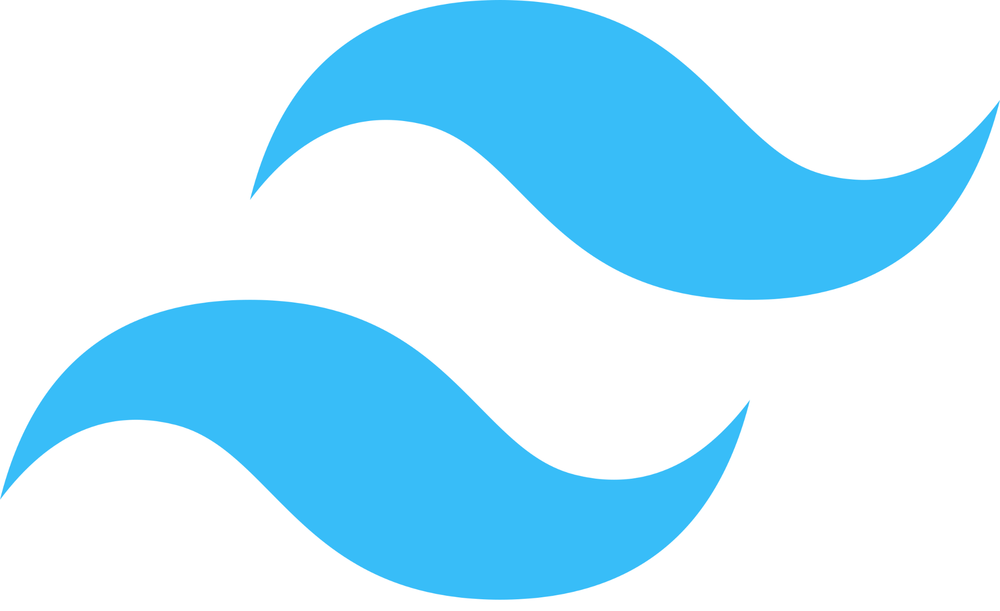

  

<h1 align="center">
  
</h1>

- 🔭 I’m currently working on [livewire-blog](https://github.com/ehsannjafari/livewire-blog)

- 🌱 I’m currently learning **VueJs**

- 👨‍💻 All of my projects are available at [https://ehsanjafari.com/project](https://ehsanjafari.com/project)

- 📝 I regularly write articles on [https://ehsanjafari.com/blog](https://ehsanjafari.com/blog)

- 💬 Ask me about **Laravel and Livewire**

- 📫 How to reach me **ehs.jafari20@gmail.com**

- 📄 Know about my experiences [https://ehsanjafari.com/experience](https://ehsanjafari.com/experience)

<h2 align="left" id="macropower-tech">Favorite Tech</h2>

> Tools, languages, and other things that I like to work with.

<table>
  <tr>
    <td align="center" width="96">
      
       Laravel
    </td>
    <td align="center" width="96">
      
       Livewire
    </td>
    <td align="center" width="96">
      
       PHP
    </td>
     <td align="center"  width="96">
      
       MySQL
    </td>
    <td align="center" width="96">
      
       JavaScript
    </td>
    <td align="center" width="96">
      
       TypeScript
    </td>
    <td align="center" width="96">
      
       ReactJS
    </td>
    <td align="center" width="96"> 
      
       VueJS
    </td>
    <td align="center" width="96"> 
      
       TailwindCSS
    </td>
   
    
  </tr>
</table>

<h2 align="left">Activity</h2>

> Total logged open-source coding. Updated every 1 hour.

  

&nbsp;
  

